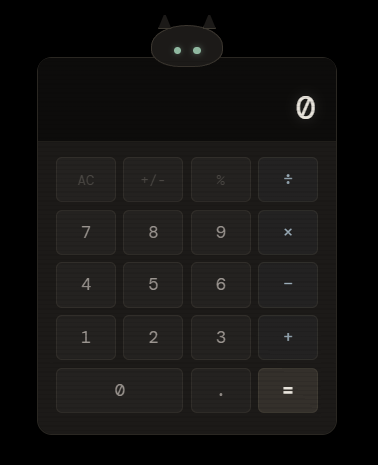

# 🐾 LunaCalc

> **"A little black pixel cat who happens to do math."**

LunaCalc is a cozy, desktop-companion calculator designed for rainy midnight coding, lo-fi study sessions, and anyone who wants a bit of magic on their screen. Luna isn't just a utility—she's alive.



---

## ✨ Why Luna?

Most calculators are boring. Luna is different. She lives in a tiny 200x280px window, always-on-top, watching your progress. She blinks, she sleeps when you're away, and she meows when you give her attention.

### 🐱 Personality & Vibe
- **Expressive Moods**: Luna gets **Happy** when you find answers, **Curious** when you start typing, and **Recoils** if you try to divide by zero (it scares her!).
- **Cozy Aesthetic**: A warm monochrome palette with 'Syne' and 'DM Mono' typography, wrapped in a subtle retro CRT scanline texture.
- **Haptic Sound**: Every click is a soft, synthesized pixel-chime. Pet her (click her head) for a cute meow!

---

## 🛠️ Feature Breakdown

- **[x] Frameless Design**: No bulky OS bars. Just Luna.
- **[x] Keyboard First**: Full physical keyboard support with real-time visual feedback on buttons.
- **[x] Always on Top**: Luna stays floating above your other apps, ready to help.
- **[x] Smart Logic**: Handles arithmetic, percentages, and chained operations with ease.
- **[x] Copy/Paste**: Double-click the result to instantly copy it to your clipboard.

---

## 🖱️ Interaction Guide

| Action | Result |
| :--- | :--- |
| **Drag Head** | Move Luna around your desk. She squints while being moved! |
| **Click Head** | Pet Luna to hear a synthesized meow. |
| **Type Digits** | Watch Luna's eyes enter "Curious" mode as she reads your math. |
| **Press Enter** | Resolve your equation and get a happy blink from Luna. |
| **Idle (90s)** | Luna will start to doze off. The window dims and she begins to Z-Z-Z. |

---

## 🚀 Quick Start

1. **Clone & Enter**:
   ```bash
   git clone https://github.com/your-username/LunaCalc.git
   cd LunaCalc
   ```
2. **Install & Run**:
   ```bash
   npm install
   ```
3. **Wake Luna Up**:
   ```bash
   npm start
   ```

---

## 🌙 Vibe Check
LunaCalc is designed for those who find comfort in the dark, the quiet, and the click of a mechanical keyboard. 

### 🖤 The Inspiration
This project is dedicated to **Luna**, my real-life black cat. She’s the true mastermind behind the pixels!

*Built with Electron & Love for Luna.* 🐾
